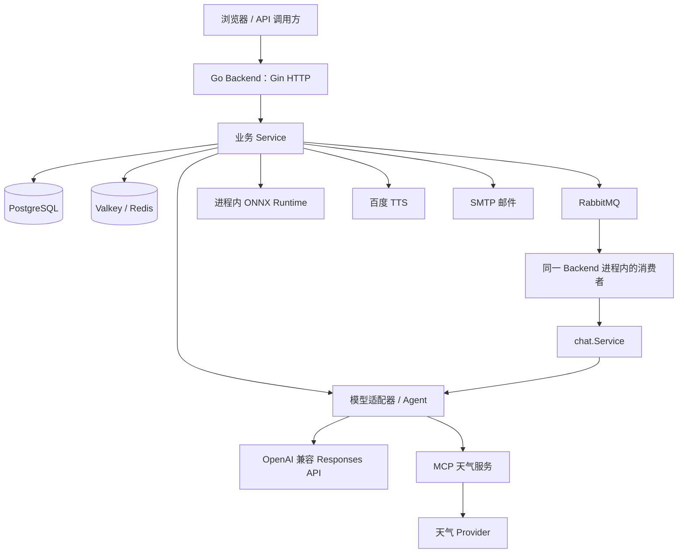

# GopherAI 后端逻辑总览

基于 2026-09-19 的实际代码；业务基线为 `31e9a34`，前端计划已在 `c30d9d9` 推送。当前暂停前端实现，先理解后端。本文件是阅读与讨论地图，不是新增功能方案，也不代表已掌握所有模块。

## 1. 先用一句话说清项目

这是一个带账号和会话持久化的 AI 应用后端：接收用户输入，组织历史和文档资料，按需调用天气工具，让模型生成答案，并保存消息、调用结果和异步任务状态；另提供本地图片分类与外部语音合成。

理解它可以分成三层问题：

1. **用户在做什么？** 注册登录、管理会话、提问、上传文档或图片、播放语音。
2. **一次操作如何完成？** 认证、校验、读取数据、执行外部调用、写结果、返回状态。
3. **中途失败怎么办？** 哪些数据已经保存，哪些可以重试，哪些结果需要查询确认。

技术组件都是这些流程的实现手段。当前代码采用 Gin、pgx 和显式 Go 接口组装；根需求和旧模板中的 EINO、GORM、MySQL 等不能当作当前实现。

## 2. 运行中的系统由什么组成



这里最容易混淆的是：

- Go Backend 内有 HTTP Server，也有后台消费 goroutine。当前没有单独部署一个 ChatJob Worker 服务。
- MCP 天气服务是另一个进程/容器；ONNX 分类器在 Backend 进程内运行。
- 普通 Chat 与 SSE 不经过 RabbitMQ。只有 ChatJob 将生成工作交给队列消费者。
- TTS 虽然也是异步任务，但任务保存在百度 Provider，不走本项目的 RabbitMQ ChatJob 链路。
- SSE 是一次 HTTP 响应的流式传输方式，不会自动把业务转为后台任务。

来源：[启动入口](../cmd/server/main.go)、[依赖组装](../cmd/server/bootstrap.go)、[Compose](../compose.yaml)。

## 3. 目录分层为什么这样设计

`cmd/server` 是组装入口：读配置、创建连接、构造 Repository 和 Service、注册 Handler、启动 HTTP 和消费者、在退出时释放资源。这里决定“接口实际使用哪个实现”。

`internal/httpapi` 是 HTTP 边界：读 Header/路径/JSON/文件，做请求大小控制，调用 Service，把业务错误映射成 HTTP 状态或 SSE 事件。它处理请求表达形式。

`internal/user`、`conversation`、`message`、`chat` 等业务包处理业务规则。以 chat 为例，它规定先保存提问、再准备上下文、再生成、最后保存回复，而不直接拼 SQL 或 Provider HTTP 报文。

`internal/platform` 接具体设施：PostgreSQL SQL、Redis Lua、RabbitMQ 协议、OpenAI SDK、ONNX、文件系统、SMTP、百度 TTS、MCP。它把外部系统的协议转换成业务需要的接口。

`migrations` 定义数据库结构和约束；`scripts/migrate.sh` 负责执行迁移；Compose 中的一次性 migration 容器完成后才启动 Backend。

接口并不是多加一层名字。例如 chat.Service 依赖 `llm.ModelClient`：不启用工具时传入 OpenAI Client，启用 MCP 时传入 Agent Client，两者都能 Generate/GenerateStream。chat.Service 不必知道天气工具如何执行。

同样，Repository 可以接 pgxpool，也可以接 pgx.Tx。Service 通过相同接口读写，组装代码决定这些操作是否属于同一个事务。测试时也能替换外部依赖。

来源：[Chat 依赖接口](../internal/chat/repository.go)、[模型接口](../internal/llm/client.go)、[Chat 事务组装](../internal/platform/postgresql/chat_unit_of_work.go)。

## 4. 启动与请求进入系统的顺序

启动的主要步骤是：读取并校验配置 → 初始化 ONNX → 连接 PostgreSQL → 构造模型客户端及可选 MCP 连接 → 连接 Redis → 组装账号/限流/RAG/TTS/Chat 依赖 → 连接 RabbitMQ 并启动消费者 → 注册路由 → 启动 HTTP。

请求到达后，公共中间件生成 Request ID、记录日志并处理 panic。受保护路由先验证 JWT，从 Token 的 subject 得到 userID；特定接口再经过限流，之后进入 Handler。

身份验证只回答“你是谁”。会话和消息 Repository 的 SQL 还通过 userID 与会话归属一起筛选，回答“你能不能操作这个对象”。不能只看到 JWT 中间件就认为资源权限已经完成。

- `/healthz` 返回存活响应。
- `/readyz` 当前实际检查 PostgreSQL 与 Redis，不逐一检查 RabbitMQ、模型、MCP、SMTP 或 TTS。
- HTTP 服务或队列消费者出现致命异常会返回到 run/main；Compose 为 Backend 配置了重启策略。
- 正常退出时取消消费者，给 HTTP Shutdown 和消费退出一个有限等待窗口，再关闭连接和 ONNX 资源。

来源：[Router](../internal/httpapi/router.go)、[认证中间件](../internal/httpapi/auth_middleware.go)、[健康检查](../internal/health/checker.go)。

## 5. 数据分别放在哪里

**PostgreSQL 保存核心关系和业务结果。** users 保存邮箱与密码哈希；conversations 属于用户；messages 属于会话；model_calls 记录一次业务生成尝试；chat_jobs 记录异步任务。

理解五张表的区别：

- conversation：这个对话容器是谁的。
- message：用户或 AI 实际说了什么。
- model_call：为某条用户消息生成回复的这次尝试是否成功、用了哪个模型和多少 Token。
- chat_job：这项异步工作是否排队、处理中或结束。
- user：身份和账号资料。

一次提问可以对应多次 model_call（例如 Job 重试）。一次成功 model_call 对应一条 assistant message。一个 model_call 内部可能包含 Agent 的规划和最终回答两次 Provider 请求，因此 model_calls 不是逐条记录外部 HTTP 调用的日志表。

**Redis/Valkey 保存限流计数、验证码临时状态以及 RAG 分块与向量。** 当前没有把会话历史缓存在 Redis；它在 RAG 中也不只是一个可随时丢掉的查询缓存。

**文件系统卷保存 RAG 原始文档。** 当前版本指针和分块向量在 Redis；只有原文件还在，并不代表查询所需的全部索引数据都在。

**RabbitMQ 消息只携带 job_id。** 任务正文和状态以 PostgreSQL 为准。Publisher confirm 表示 Broker 接受了消息，不表示模型已经完成生成。

**百度保存 TTS 任务和音频。** 本地没有 TTS 任务归属表；图片识别当前也不落一张“识别历史”表。

来源：[迁移文件](../migrations)、[ChatJob SQL](../internal/platform/postgresql/chat_jobs_sql.go)、[Redis RAG](../internal/platform/redis/rag_repository.go)、[队列发布](../internal/platform/rabbitmq/publisher.go)。

## 6. 核心主线：一次普通 Chat 怎样完成

用“用户在已有会话里问一个问题”作为例子：

1. Handler 取得可信 userID、URL 中的 conversationID 和 JSON content，并设置两分钟上下文超时。
2. `ReceiveAndResponse` 调用 `receive/startModelCall`。**短事务 A**：创建 user message，再创建 running model_call；任何一步失败，整个事务回滚。
3. `respond` 读取最近 40 条消息，定位本次提问；这就是多轮上下文的来源，不是模型自动永久记住网站上的对话。
4. `prepareModelMessages` 根据当前提问检索用户文档，取最多 4 个相关块，拼入发给模型的本次问题。数据库中的原始用户消息不被这些资料覆盖。
5. 在数据库事务外调用 `model.Generate`。实际对象可能是普通 OpenAI Client，也可能是 Agent Client。
6. 模型成功后执行**短事务 B**：保存 assistant message，并把 model_call 改成 completed，关联回复及 usage。
7. Handler 返回这条 assistant message 与模型/token 元信息。

```text
短事务 A                 不持有数据库事务的生成阶段                短事务 B
用户消息 + running记录 → 历史 → RAG → 模型/工具 → 完整结果 → 回复消息 + completed记录
```

两个短事务的目的，是把各自必须一起成功的写入绑在一起，同时避免等待外部模型时长期占着数据库事务。

后半段失败不会撤销已经提交的用户消息。代码尝试把 model_call 标为 failed、cancelled、timed_out 或 incomplete，并使用脱离原请求取消信号的五秒清理上下文收尾。数据库不可用时，收尾本身也可能失败，不能承诺每次故障都有完美终态。

消息表保存内容，model_calls 保存生成过程的结果。流中断时并不逐个 delta 持久化，也不能从已有字段推断“所有失败请求的已消费 Token 都完整记录了”。

来源：[Chat Service](../internal/chat/service.go)，重点阅读 `startModelCall`、`respond`、`saveAssistantAndComplete`、`finishFailedModelCall`。

## 7. SSE 和普通 Chat 共用什么、改变什么

SSE 仍然执行上面的用户消息事务、历史/RAG、模型调用和最终落库。不同之处是生成函数换成 GenerateStream，模型文本通过 onDelta 回调传给 Handler，再写成 SSE 的 delta 事件。

- delta 表示当前收到一段文本，不证明完整回复已经保存。
- 最终保存成功后 Handler 才发 done；业务失败发 error。
- 客户端断开会通过 context 影响生成；已经提交的用户消息不会因此自动删除。
- 后端把 Provider 的流事件转换为自己的 delta/error/done，前端不直接消费 OpenAI 原始事件。

**当前 Agent 的特殊行为需要单独记住：**启用 MCP 且走工具规划流时，规划阶段 delta 先缓存在内存。若规划没有工具调用，规划完成后才把缓存文本依次发出；若有工具调用，丢弃规划文字，仅转发最终回答流。因此“用了 SSE”不等于所有场景都从首个 Provider Token 开始实时展示。

这个缓冲逻辑是当前代码的实际行为；后续讲流式性能时应把“上游生成流”“Agent 缓冲”“客户端收到事件”三个时间点分开。

来源：[Chat Handler](../internal/httpapi/chat_handler.go)、[Agent](../internal/agent/client.go)、[Provider 流适配](../internal/platform/openai/client.go)。

## 8. ChatJob 为什么单独需要一套状态

请求线程负责：创建 pending Job → 发布 job_id 到 RabbitMQ → 返回 202。随后用户通过查询接口观察任务，HTTP 创建请求不等待生成结果。

消费者负责：

1. 收到 job_id，以条件 UPDATE 抢占 pending Job，改为 processing 并增加 attempt_count。
2. 创建或复用该 Job 的用户消息（request_message_id），防止每次重试都重复写一条提问。
3. 查询该提问是否已有 completed model_call。如果回复已写成功、只差 Job 完成标记，就直接复用已有回复。
4. 否则调用 `chat.Service.RespondToMessage`。它为已有用户消息开始一次 model_call，然后复用普通 Chat 的 respond 主流程。
5. 成功则把 Job 标为 completed；失败且未到尝试上限则改回 pending 并向消费者返回错误；到上限后尝试持久化 failed。
6. Process 返回 nil → Ack；返回错误 → Nack 并重新入队。损坏或无效队列消息被 Reject、不重新入队。

**模型生成失败但 failed 已可靠记录，也应 Ack。** 队列在确认“这份工作是否已处理出明确结果”，不要求每份工作都业务成功。

当前每个 Backend 进程启动一个消费循环，prefetch=1。它不是无限并发工作池。

```text
pending → processing → completed
              ├──────→ failed
              └──────→ pending（重试）
```

已有保护减少重复用户消息和已完成回复的重复生成，但不能称为端到端 exactly-once：

- Job 写库与 MQ 发布不是原子操作，可能留下无队列消息的 pending Job。
- 不存在 processing lease/扫描恢复；崩溃在处理中的恢复能力有限，不能宣称重启必然继续完成全部任务。
- 状态数据库本身故障时，重试/失败标记也可能写不进去；maxAttempts 不是所有基础设施故障下都能保证的重投递次数上限。

来源：[Job Service](../internal/chatjob/service.go)、[Job SQL](../internal/platform/postgresql/chat_jobs_sql.go)、[消费者](../internal/platform/rabbitmq/consumer.go)。以上是现有机制与边界说明，本轮不扩展可靠性方案。

## 9. RAG：先找资料，再让模型回答

RAG 在本项目中有“上传建索引”和“提问检索”两条链。

上传：检查 `.txt/.md`、UTF-8 和大小 → 每块 1000 个 rune、相邻重叠 150 → Embedding API 生成向量 → 文件系统保存版本化原文 → Redis 写对应 chunks → Lua 原子切换用户 current 版本。

新版本先准备好再激活，避免用户检索到半份新索引。未激活/旧版本向量有清理 TTL；旧原文件做尽力清理。文件系统和 Redis 之间没有跨系统事务，Service 用补偿和版本指针管理失败。

提问：读用户 current 版本及其全部 chunks → 对问题做 Embedding → Go 中计算余弦相似度并排序 → 取 topK → 拼接资料与原问题 → 调模型。

当前是读取 Redis 中的向量后在 Go 内搜索，没有使用专用向量数据库或 Redis 向量检索引擎。它也没有训练/微调模型，资料通过上下文进入本次请求。

每个用户只有一份当前文档，所有会话共享。没有文档时正常聊天；已有文档但检索设施出错时会报错，不静默跳过 RAG。

来源：[RAG Service](../internal/rag/service.go)、[切块](../internal/rag/chunker.go)、[相似度检索](../internal/rag/retriever.go)、[版本激活](../internal/platform/redis/rag_repository.go)。

## 10. Agent / MCP：模型决定是否用工具，程序执行工具

配置 MCP 时，启动阶段连接 MCP Server，发现并缓存 get_weather 定义。Agent 将工具定义和对话内容交给模型规划。

- 没有工具调用：直接采用模型回答。
- 一个工具调用：校验工具名与参数 → MCP Client 调用天气服务 → 获取结构化天气数据 → 把工具结果与必要的规划上下文交回模型 → 获得最终回答。
- 超过一次调用：当前边界拒绝，不进入多轮自主工具循环。

模型输出的是调用请求，不直接访问天气网络；实际调用由 Go 执行。MCP 负责工具发现/调用协议，Agent 负责“规划、执行、再回答”的顺序。它们职责不同。

Agent 把规划与最终回答的 token usage 相加，向 chat.Service 返回统一的 llm.Result。前端仍使用普通 Chat 协议，不必知道 MCP 在哪里。

来源：[Agent 编排](../internal/agent/client.go)、[MCP 客户端](../internal/platform/mcp/client.go)、[天气工具服务](../internal/platform/mcp/weather_server.go)。

## 11. 账号、验证码与限流

注册规范化邮箱、验证密码规则，用 bcrypt 哈希保存密码；开启邮箱验证时，先校验并消费验证码，再创建用户。登录检查密码哈希，由 JWT TokenManager 签发 HS256 Token，当前有效期一小时。

JWT 验证签名、算法、issuer、exp 等后提取 userID，不依赖服务端会话表。当前没有刷新 Token、注销接口或撤销名单。

验证码流程为：生成六位随机数字 → Redis 原子保存 code/发送冷却/尝试次数状态 → SMTP 发送。发送失败时按本次 code 做补偿删除；验证成功时原子消费。注册后的 PostgreSQL 写入与 Redis 消费不属于同一事务，验证码已消费后后续注册失败不会自动恢复验证码。

限流使用 Redis Lua 原子 INCR，第一次请求设置窗口 TTL，返回计数和剩余 TTL。它是从首个请求建立窗口的计数限制，不是令牌桶。超额返回 429，限流设施故障返回 503；允许进入 Handler 的失败请求也可能已计入额度。

公开认证接口按直连来源 IP 限流，Chat/RAG/TTS 按 userID 限流。普通 Chat、SSE 和 ChatJob 创建共用 Chat 额度。

来源：[用户 Service](../internal/user/service.go)、[JWT](../internal/auth/token.go)、[验证码 Service](../internal/emailverification/service.go)、[Redis 限流](../internal/platform/redis/rate_limiter.go)。

## 12. 图片识别与 TTS 是两条独立能力链

图片：multipart 上传 → 解码 JPEG/PNG 并检查尺寸 → 短边缩放到 256 → 中心裁剪 224×224 → 按 RGB 通道归一化、组织 CHW 数据 → ONNX Runtime 运行 MobileNetV2 → 最大输出分数对应标签 → 返回 class_name。

模型在启动时加载，多个请求复用 session 和 tensor，推理区间用 mutex 保护。当前是本地分类，不是把图片发给聊天模型，也不返回检测框或置信度。

TTS：text → tts.Service 校验 → 百度适配器创建任务 → 返回 task_id → 客户端经后端轮询 Provider → 将外部状态映射成 running/succeeded/failed → 返回临时 audio_url 播放。

百度鉴权 Token 与用户登录 JWT 是两套用途不同的凭据。当前没有在本地持久化 TTS 任务与用户的归属，这是已接受的 MVP 边界。

来源：[图片 Service](../internal/image/service.go)、[图片预处理](../internal/platform/onnx/preprocessing.go)、[分类器](../internal/platform/onnx/classifier.go)、[TTS Service](../internal/tts/service.go)、[百度适配器](../internal/platform/baidutts/client.go)。

## 13. 接下来按什么顺序学

建议每次只沿一条业务链读代码，保持“输入 → 状态变化 → 外部调用 → 输出/失败”的顺序，不按文件夹挨个背。

1. **普通 Chat**：用一次问答串起 Handler、Service、Repository、事务和 Provider。这是首个重点。
2. **启动组装与接口**：解释上一条链中的对象怎样创建、接口实际绑定什么实现。
3. **数据模型与鉴权**：分清五张表、资源归属和 model_call 状态。
4. **SSE**：保持业务链不变，只沿回调和 context 看增量输出、取消与落库。
5. **ChatJob**：理解请求返回后谁继续工作，逐个分析 Ack/Nack、重试和重复执行保护。
6. **RAG 与 Agent/MCP**：把检索与工具调用分别插回已经理解的 Chat 主线。
7. **图片、TTS、邮箱与限流**：各自独立梳理适配器和边界，最后回看 Compose 与运行验证。

读每个模块时固定回答四个问题：谁调用它；它修改什么状态；失败时已经发生了什么；哪个测试证明这个行为。代码注释里的设想与当前执行路径不一致时，以实际执行路径和测试为准。

第一轮先能独立解释三个问题即可：普通 Chat 的用户消息何时保存；为什么要分成两个短事务；模型失败后为什么仍可能看到用户提问。之后再展开下一模块。
