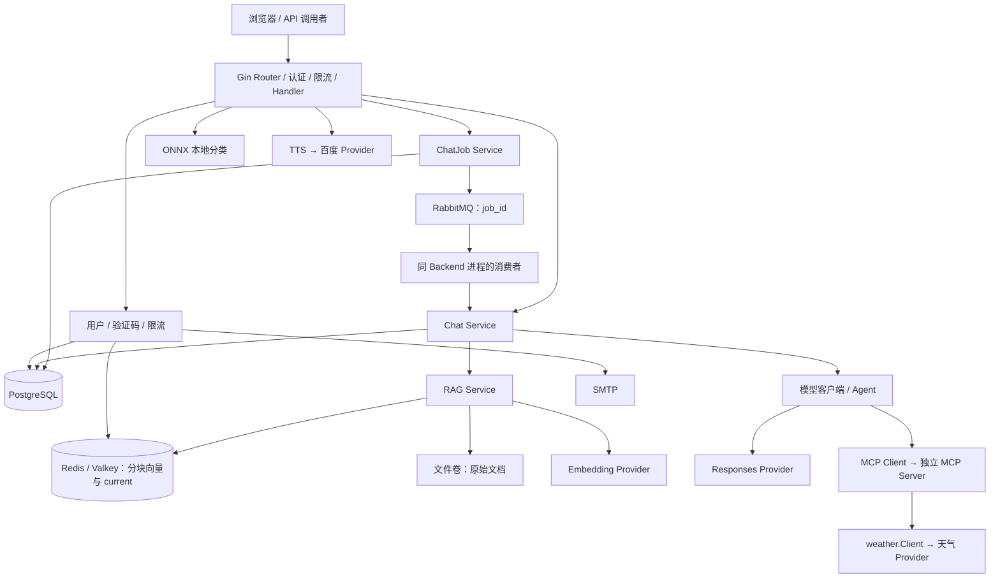

# GopherAI 后端复习手册

更新：2026-09-21 · 代码基线：`77a8ad9`。本文根据当前代码与本轮结对讨论整理。

本文面向后续复习和项目讲解：先沿主线理解输入、状态和输出，再追具体实现。代码链接固定到本次基线提交；未来代码变化后应重新核对。

配套交互页面：[backend-review.html](backend-review.html)，可直接用浏览器离线打开。它是学习用的静态架构与流程演示，不发送 API 请求，不代表实际服务状态，不是正式业务前端。

## 阅读顺序

快速复习：架构与存储 → 普通 Chat 两个事务 → SSE 完成语义 → Job 重试 → 易混概念。完整复习再展开 RAG、Agent、图片、TTS、账号、验证码、限流和生命周期。每次只展开一个函数层级，先回答“谁调用、改什么状态、失败后留下什么”。

## 系统架构



图中箭头表示依赖或调用方向，响应沿调用链返回。RAG 上传与检索使用的设施不同：原文件在上传时保存，检索主要读取 Redis 中的分块和向量。

## 数据与职责速记

- PostgreSQL：users（邮箱和密码哈希）、conversations（归属）、messages（正文）、model_calls（生成尝试）、chat_jobs（异步工作）。
- Redis/Valkey：限流计数、验证码与冷却/尝试次数、RAG 分块向量与当前版本指针。
- 文件系统：RAG 原始文档；没有自动原文件过期机制。
- RabbitMQ：仅携带 job_id；任务正文、尝试次数和状态以 PostgreSQL 为准。
- 百度：TTS 任务与临时音频；后端内存缓存百度 access_token。
- ONNX：进程内模型 session、输入输出 tensor；共享 tensor 需要互斥。

## 1. 分层与依赖

系统围绕“接收提问、准备上下文、生成并保存结果”组织；工具、队列和存储都接在这条业务主线上。

### 执行路径

```text
cmd/server 创建依赖
→ Router 与中间件接收请求
→ Handler 解析输入并映射响应
→ Service 编排业务步骤
→ Repository / Provider 接入实际设施
```

### 关键理解

- Handler 处理 HTTP 形式；Service 决定执行顺序与业务约束；platform 包实现 SQL、Redis、RabbitMQ、模型 API、文件和推理引擎。
- 接口描述需要哪些方法。buildModelFeature 不配置 MCP_SERVER_URL 时返回基础模型客户端；配置后检查 agent.Model 并连接 MCP。Compose 当前明确配置了 MCP 地址。
- base.(agent.Model) 是类型断言：检查具体对象原本是否实现目标接口，不增加能力、不修改动态值，也不检查字段。实现了 Go 接口不保证远端 Provider 真支持 Tool Calling。
- 数据归属：PostgreSQL 保存用户/会话/消息/调用/Job；Redis 保存限流、验证码和 RAG 向量；文件系统保存原文；RabbitMQ 消息携带 job_id；百度保存 TTS 任务。

### 特别注意

- 一个 model_call 是一次业务生成尝试，内部可能有规划和最终回答两次 Provider 请求。
- 后台消费者在 Backend 进程内；MCP Server 是独立服务；ONNX 在 Backend 进程内。

### 对照代码

- [cmd/server/bootstrap.go:102](https://github.com/via2004/gopher-agent-platform/blob/77a8ad97a92ca4bfd9af0e340dcbb4729a5c74e1/cmd/server/bootstrap.go#L102)
- [cmd/server/bootstrap.go:225](https://github.com/via2004/gopher-agent-platform/blob/77a8ad97a92ca4bfd9af0e340dcbb4729a5c74e1/cmd/server/bootstrap.go#L225)
- [internal/llm/client.go:30](https://github.com/via2004/gopher-agent-platform/blob/77a8ad97a92ca4bfd9af0e340dcbb4729a5c74e1/internal/llm/client.go#L30)

### 自测

类型断言能把不支持工具调用的客户端变成支持工具调用的客户端吗？

<details>
<summary>展开参考答案</summary>

不能。它只检查底层具体对象已经具备的方法集合；失败时 ok=false。

</details>

## 2. 普通 Chat 与事务

POST /api/v1/conversations/:id/chat：当前请求等待生成和持久化完成，返回完整 assistant 消息。

### 执行路径

```text
Chat → receive
→ 事务 A：user message + running model_call
→ ListRecent：最近 40 条消息
→ prepareModelMessages：定位提问并补 RAG
→ 事务外 Generate
→ 事务 B：assistant message + completed model_call
→ toResult → HTTP JSON
```

### 关键理解

- 事务 A 把提问与调用开始记录绑定；事务 B 把回复与调用完成记录绑定。外部模型请求在两者之间，不长时间持有数据库事务。
- UnitOfWork 不等于另一个数据库。常规 Service 底层共用连接池；事务回调得到的两个 Service 共享同一个 pgx.Tx，只有走这个 tx 的 SQL 才加入事务。
- 局部 callRecord 是调用记录；s.model 是生成客户端；modelResult 是生成结果。这三个对象职责不同。
- 后半段失败保留已经提交的用户消息。finishFailedModelCall 尝试更新已有调用记录，并使用独立的五秒清理 context；数据库故障时收尾仍可能失败。
- 调用状态有 running/completed/failed/cancelled/timed_out/incomplete。LLM 超时的错误码可为 llm_timed_out，HTTP 返回则是 504 和 TIMEOUT，两套表达不能混用。

### 特别注意

- 模型已经生成成功，不代表业务已经提交成功。事务 B 中 Complete 失败会回滚该事务插入的 AI 回复，不能撤销外部模型生成和费用。
- 普通 Chat 本身没有 ChatJob 的队列重试；不要先 POST messages 再 POST chat，否则重复写提问。

### 对照代码

- [internal/chat/service.go:55](https://github.com/via2004/gopher-agent-platform/blob/77a8ad97a92ca4bfd9af0e340dcbb4729a5c74e1/internal/chat/service.go#L55)
- [internal/chat/service.go:208](https://github.com/via2004/gopher-agent-platform/blob/77a8ad97a92ca4bfd9af0e340dcbb4729a5c74e1/internal/chat/service.go#L208)
- [internal/platform/postgresql/chat_unit_of_work.go:16](https://github.com/via2004/gopher-agent-platform/blob/77a8ad97a92ca4bfd9af0e340dcbb4729a5c74e1/internal/platform/postgresql/chat_unit_of_work.go#L16)
- [internal/chat/service.go:256](https://github.com/via2004/gopher-agent-platform/blob/77a8ad97a92ca4bfd9af0e340dcbb4729a5c74e1/internal/chat/service.go#L256)

### 自测

事务 A 已提交，模型超时。用户消息、AI 回复、调用记录分别怎样？

<details>
<summary>展开参考答案</summary>

用户提问保留；没有成功保存的 AI 回复；尝试将已有调用记录改为 timed_out，错误码为 llm_timed_out。收尾写库也可能失败。

</details>

## 3. SSE 流式 Chat

POST /api/v1/conversations/:id/chat/stream：复用 Chat 业务流程，把生成过程中的正文交给回调发送。

### 执行路径

```text
Handler 定义 onDelta
→ ChatStreaming 封装 GenerateStream
→ Provider 正文 → onDelta → delta + Flush
→ Provider response.completed
→ 事务 B 保存完整回复
→ Handler 发 done
```

### 关键理解

- generateFunc 抽象生成方式：普通与流式的输入和最终结果形状一致，流式额外通过闭包携带 onDelta。回调不等于新开 goroutine。
- 正文一份通过回调输出，一份在内存累积；数据库不逐段写 delta。done 只包含消息 ID、时间、模型和 usage，不含完整正文。
- 事件为 delta/error/done。流开始前可能返回普通 HTTP JSON 错误；流开始后业务错误可能在 HTTP 200 内用 error 事件表达。
- 模型适配层收到 response.completed 才返回完整结果；Service 提交事务 B 后，Handler 才发送 done。
- 客户端没收到 done 表示未确认成功，不能断言服务端没提交。断线后应查询历史确认，不能自动重发写请求。

### 特别注意

- 上游完成、数据库提交、客户端收到 done 是三个时间点。
- SSE 不绑定 RabbitMQ，没有队列重试。浏览器原生 EventSource 不能直接满足这个 POST + Authorization 协议。

### 对照代码

- [internal/chat/service.go:78](https://github.com/via2004/gopher-agent-platform/blob/77a8ad97a92ca4bfd9af0e340dcbb4729a5c74e1/internal/chat/service.go#L78)
- [internal/httpapi/chat_handler.go:133](https://github.com/via2004/gopher-agent-platform/blob/77a8ad97a92ca4bfd9af0e340dcbb4729a5c74e1/internal/httpapi/chat_handler.go#L133)
- [internal/platform/openai/client.go:341](https://github.com/via2004/gopher-agent-platform/blob/77a8ad97a92ca4bfd9af0e340dcbb4729a5c74e1/internal/platform/openai/client.go#L341)

### 自测

浏览器已显示全部正文，但保存 AI 回复失败，可以标记成功吗？

<details>
<summary>展开参考答案</summary>

不可以。应等待 done；若 error 则失败，若断流且无终态则状态未确认。最终持久化情况需查询历史。

</details>

## 4. ChatJob 与队列

POST /api/v1/conversations/:id/chat-jobs 创建异步工作；消费者使用非流式生成，前端查询任务后加载消息。

### 执行路径

```text
Create：pending Job，保存提问正文
→ PublishChatJob：发布 job_id
→ HTTP 返回 202
→ Claim：processing，attempt_count + 1
→ EnsureRequestMessage：创建/复用提问
→ FindCompletedAssistantID：查已有回复
→ ChatFromExistingMessage → Generate
→ Complete 或 Retry/Fail → Ack/Nack
```

### 关键理解

- 创建接口只创建 Job，不创建 user message。用户消息由消费者处理时创建，并关联 request_message_id；之后重试复用它。
- ChatFromExistingMessage 为已有提问新增调用记录，并进入 respond；上下文从任务执行时的最近历史加载，不是提交时冻结的快照。
- 当前 attempt_count 默认 0，在成功领取 pending 任务的 SQL 中加一，包含首次执行。maxAttempts=3 意味着最多三次正常处理尝试，而不是三次额外重试。
- Retry 只恢复数据库 pending、清空 started_at，保留尝试次数和用户消息；Process 返回错误后消费者 Nack(requeue=true)，RabbitMQ 才会重新投递。
- 已记录 failed 也返回 nil 并 Ack，因为任务已有终态。Fail 写库失败则返回错误。队列消息的处理完成不等于模型业务成功。
- 已有 completed model_call 时复用 assistant ID，只补 Job 完成状态；只减少部分重复执行，不保证端到端 exactly-once。

### 特别注意

- 当前 ErrJobNotClaimable 统一返回 nil：Retry/Fail 写失败留下 processing 时，重投递可能被 Ack 并遗留状态。恢复方案只是文档，暂缓实现。
- 数据库 Job 写入与 MQ 发布不是一个事务；发布失败不回滚 Job，确认丢失时也可能实际上已入队。

### 对照代码

- [internal/chatjob/service.go:78](https://github.com/via2004/gopher-agent-platform/blob/77a8ad97a92ca4bfd9af0e340dcbb4729a5c74e1/internal/chatjob/service.go#L78)
- [internal/platform/postgresql/chat_jobs_sql.go:28](https://github.com/via2004/gopher-agent-platform/blob/77a8ad97a92ca4bfd9af0e340dcbb4729a5c74e1/internal/platform/postgresql/chat_jobs_sql.go#L28)
- [internal/platform/postgresql/chat_jobs_sql.go:43](https://github.com/via2004/gopher-agent-platform/blob/77a8ad97a92ca4bfd9af0e340dcbb4729a5c74e1/internal/platform/postgresql/chat_jobs_sql.go#L43)
- [internal/platform/rabbitmq/consumer.go:13](https://github.com/via2004/gopher-agent-platform/blob/77a8ad97a92ca4bfd9af0e340dcbb4729a5c74e1/internal/platform/rabbitmq/consumer.go#L13)

### 自测

为什么既要 Retry 把状态改回 pending，又要 Nack(requeue=true)？

<details>
<summary>展开参考答案</summary>

前者保证数据库任务能再次被领取；后者保证队列消息再次投递。只改状态没有新投递，只重投递而仍是 processing 则无法正常领取。

</details>

## 5. RabbitMQ 发布确认

PublishChatJob 等待的是 Broker 的发布确认，不是用户提问的生成结果。

### 执行路径

```text
job_id 序列化 JSON
→ 复用 Connection 创建 AMQP Channel
→ NotifyReturn + Confirm(false)
→ 发到 gopherai.jobs / chat.generate
→ WaitContext 等待发布确认
→ 检查 mandatory Return
→ 关闭本次 Channel
```

### 关键理解

- 启动时声明 direct Exchange 与 durable Queue（QueueDeclare 第二个参数 true），并绑定路由键 chat.generate；目标队列是 gopherai.chat.jobs。
- AMQP Channel 是协议通道，chan amqp.Return 是 Go channel。Confirm(false) 的 false 表示 noWait=false，等待开启确认模式的应答。
- mandatory=true 请求无法路由时退回；Persistent 是消息持久化标记，与队列 durable 是两项独立配置。
- 收到肯定 Confirm 仍需检查 Return：不可路由的 mandatory 消息也可能被确认，Broker 先发送 Return 再发送 Confirm。
- 如果等待确认超时，消息可能未入队，也可能已入队但确认丢失。发布方不能只根据 error 就判断远端没有执行。

### 特别注意

- 生产者 Confirm 与消费者 Ack 是两段不同的确认。
- Nack 只有指定 requeue=true 才请求重新入队；当前消费者忽略 Ack/Nack/Reject 返回错误是现有边界。

### 对照代码

- [internal/platform/rabbitmq/publisher.go:15](https://github.com/via2004/gopher-agent-platform/blob/77a8ad97a92ca4bfd9af0e340dcbb4729a5c74e1/internal/platform/rabbitmq/publisher.go#L15)
- [internal/platform/rabbitmq/broker.go:55](https://github.com/via2004/gopher-agent-platform/blob/77a8ad97a92ca4bfd9af0e340dcbb4729a5c74e1/internal/platform/rabbitmq/broker.go#L55)

### 自测

发布返回错误，消费者是不是一定收不到？

<details>
<summary>展开参考答案</summary>

不一定。若错误发生在发送之前则收不到；消息入队后的确认超时或连接中断仍可能返回错误。

</details>

## 6. RAG 上传与检索

RAG 为模型准备参考资料，不训练模型。一个用户有一份当前文档，所有会话共享。

### 执行路径

```text
Upload：校验 txt/md、UTF-8、大小
→ SplitText：1000 rune / overlap 150
→ Embed：片段转向量
→ 文件保存原文，Redis Replace 写 chunks
→ Activate 切换 current
→ Retrieve：问题向量与文档向量比较
→ Go 余弦排序，最多取 4 块正文
→ 拼入模型输入中的本次提问
```

### 关键理解

- Redis current key 的值是版本号；versionKey 的值是 chunks JSON，每块包含 index/content/vector。先读 current，再按版本取 chunks。
- Replace 写新版本时有 24 小时 staging TTL；激活时 PERSIST 新版本、SET current、给旧 chunks 设置 24 小时 TTL。不是所有新版本都永久存储。
- 激活前 Chat 仍读取原 current；新文档 Embedding 失败不会替换旧文档。文件系统和 Redis 之间没有全局事务。
- Activate 报错可能只是执行成功后的响应丢失，因此保留新原文。若激活没有执行，新 chunks 有 TTL；文件系统原文没有自动过期，定时清理暂不实现。
- fmt.Errorf 的 %w 保留底层错误。Sentinel 可以表达分类，但只有明确证明未生效时才能安全清理；错误分类不能凭空确定远端状态。
- 检索读出向量，在 Go 中计算余弦相似度。交给生成模型的是选中的片段正文，不是向量；数据库里的原问题不被 RAG 资料覆盖。

### 特别注意

- Lua 的原子执行表示其他命令不会穿插；不是数据库式的出错自动回滚。不能把所有 Lua 错误都当成没有任何写入。
- 无文档正常聊天；检索设施故障则停止生成。Activate 的 PERSIST 后若发生脚本中途错误，不能只凭 error 保证 staging TTL 仍存在。

### 对照代码

- [internal/rag/service.go:40](https://github.com/via2004/gopher-agent-platform/blob/77a8ad97a92ca4bfd9af0e340dcbb4729a5c74e1/internal/rag/service.go#L40)
- [internal/rag/service.go:126](https://github.com/via2004/gopher-agent-platform/blob/77a8ad97a92ca4bfd9af0e340dcbb4729a5c74e1/internal/rag/service.go#L126)
- [internal/platform/redis/rag_repository.go:31](https://github.com/via2004/gopher-agent-platform/blob/77a8ad97a92ca4bfd9af0e340dcbb4729a5c74e1/internal/platform/redis/rag_repository.go#L31)
- [internal/rag/retriever.go:8](https://github.com/via2004/gopher-agent-platform/blob/77a8ad97a92ca4bfd9af0e340dcbb4729a5c74e1/internal/rag/retriever.go#L8)

### 自测

新 chunks 已写入，但 Activate 还没执行，新提问检索哪个版本？

<details>
<summary>展开参考答案</summary>

仍通过 current 获取旧版本。只有新版本成功激活后 current 才切换；新原文存在不代表它已生效。

</details>

## 7. Agent / MCP 工具调用

Chat 调用统一的 llm.ModelClient；启用 MCP 时实际对象是 agent.Client。当前仅允许一次 get_weather 调用。

### 执行路径

```text
GenerateWithTools：消息 + 工具定义交给模型
→ 模型返回普通回答或 function call
→ 0 次工具调用：直接返回
→ 1 次：MCP Client → MCP Server
→ weather.Client 请求天气 Provider
→ GenerateWithToolResult：携带 continuation + 工具结果
→ 汇总两次模型请求的 usage
```

### 关键理解

- 模型决定是否调用工具；Agent 安排调用顺序；MCP Client 发送工具请求；MCP Server 内的 weather.Client 才实际访问天气 Provider。
- 工具参数结构 WeatherInput 由我们定义，MCP SDK 根据 Go struct 生成 JSON Schema。外层 type=object 表示整组命名参数，city 字段才是 string。SDK 不是 Go 标准库。
- functionTools 将内部工具定义转换成 OpenAI SDK 参数，并要求顶层 object；json.Unmarshal 成功与 schema["type"]=="object" 检查的是不同问题。
- 第二次请求使用同一个配置模型，携带消息、原 output 的 continuation、带 call_id 的工具结果；它是继续回答，不要求更换模型。
- Include reasoning.encrypted_content 用来保留不透明推理内容并回传以接续请求；不是 TLS 传输加密，不是把用户文本全部加密，也不是客户端读取明文思考。
- Agent.Generate / GenerateStream 将规划和最终回答的 token usage 相加。工具 HTTP 查询本身不是一次生成模型请求。

### 特别注意

- 流式规划正文先缓存：无工具则规划完成后转发；有工具则丢弃缓存，仅转发最终回答。正文 delta 与 encrypted_content 是两类数据。
- agent.Model 的类型断言仅证明本地方法集合满足要求；配置 MCP 时连接/工具发现失败会阻止启动，不自动降级。

### 对照代码

- [internal/agent/client.go:45](https://github.com/via2004/gopher-agent-platform/blob/77a8ad97a92ca4bfd9af0e340dcbb4729a5c74e1/internal/agent/client.go#L45)
- [internal/agent/client.go:84](https://github.com/via2004/gopher-agent-platform/blob/77a8ad97a92ca4bfd9af0e340dcbb4729a5c74e1/internal/agent/client.go#L84)
- [internal/platform/mcp/weather_server.go:19](https://github.com/via2004/gopher-agent-platform/blob/77a8ad97a92ca4bfd9af0e340dcbb4729a5c74e1/internal/platform/mcp/weather_server.go#L19)
- [internal/platform/openai/client.go:230](https://github.com/via2004/gopher-agent-platform/blob/77a8ad97a92ca4bfd9af0e340dcbb4729a5c74e1/internal/platform/openai/client.go#L230)

### 自测

外层只调用一次 Generate，为什么可能有两次模型用量？

<details>
<summary>展开参考答案</summary>

Agent 内部先请求模型决定工具调用，再执行工具并第二次请求模型生成答案，最终汇总两次 usage。没有工具调用则直接返回第一次结果。

</details>

## 8. 本地图片分类

接口接收图片，模型接收数字 tensor；模型输出分数，Go 再转换成类别名称。

### 执行路径

```text
multipart image → JPEG/PNG 解码校验
→ 等比缩放短边到 256
→ 中心裁剪 224 × 224
→ RGB 归一化、HWC → CHW
→ 加锁：填输入 → session.Run → 读输出
→ 1000 类分数取最大值下标
→ labels 下标 → class_name
```

### 关键理解

- 输入形状 [1,3,224,224]，输出形状 [1,1000]。模型不是直接返回文字标签，接口也不提供概率或检测框。
- 缩放保持比例避免变形；小图也会被放大。中心裁剪舍弃边缘，不保证主体完整保留。
- 归一化遵循该模型预处理约定：(pixel/255 - mean)/std；RGB mean 为 0.485/0.456/0.406，std 为 0.229/0.224/0.225。
- 每次请求的预处理数组独立；输入输出 tensor 与 session 复用，锁保护填入、运行、读取整个区间，防止请求互相覆盖。
- 启动时 NewClassifier 加载 Runtime/模型/标签/tensor；退出时 Close 显式销毁资源，并用同一把锁避免与推理并行销毁。

### 特别注意

- 这是本地 MobileNetV2 分类，不是多模态聊天，也没有训练本地模型。
- 图片上限包含请求体 10 MiB、单边 8192、总像素 2500 万；文件大小与像素总数不是同一个指标。

### 对照代码

- [internal/image/service.go:26](https://github.com/via2004/gopher-agent-platform/blob/77a8ad97a92ca4bfd9af0e340dcbb4729a5c74e1/internal/image/service.go#L26)
- [internal/platform/onnx/preprocessing.go:15](https://github.com/via2004/gopher-agent-platform/blob/77a8ad97a92ca4bfd9af0e340dcbb4729a5c74e1/internal/platform/onnx/preprocessing.go#L15)
- [internal/platform/onnx/classifier.go:132](https://github.com/via2004/gopher-agent-platform/blob/77a8ad97a92ca4bfd9af0e340dcbb4729a5c74e1/internal/platform/onnx/classifier.go#L132)

### 自测

为什么锁不能只包住 session.Run？

<details>
<summary>展开参考答案</summary>

输入输出 tensor 也是共享资源；填入前或读取前若被另一请求覆盖，即使 Run 串行也会串数据。

</details>

## 9. TTS 任务与凭据

任务在百度保存和执行；Go 提交文本、查询状态并转换响应，前端持续轮询。

### 执行路径

```text
POST /tts/tasks 校验 text
→ accessToken 获取/复用百度凭据
→ Provider 创建任务 → task_id
→ 前端 GET /tts/tasks/:id
→ 后端单次查询百度并映射状态
→ succeeded → audio_url 播放
```

### 关键理解

- 不创建本地 TTS 任务表，不走 RabbitMQ。创建成功表示受理，不表示音频完成；关闭页面也不会触发百度任务取消。
- 任务状态 running/succeeded/failed。running 不应有 URL 或错误；succeeded 必须有 URL、无错误；failed 必须有错误、无 URL。
- validTask 校验状态与字段组合；百度适配层检查 URL 的 http/https 格式与任务 ID，不代表验证了音频一定可下载。
- 用户 JWT 验证用户；百度 access_token 验证后端应用。百度 Token 在后端缓存，提前一分钟判断是否需要刷新，互斥锁保护缓存/刷新。
- 百度两个凭据都为空时 TTS 关闭并返回 503；只配置一个属于启动配置错误。

### 特别注意

- 前端轮询，后端 Get 每次只查询一次；本项目没有 TTS 的后台轮询消费者。
- 已接受边界：本地不保存 user_id → task_id 严格归属。临时 audio_url 不是永久资产。

### 对照代码

- [internal/tts/service.go:21](https://github.com/via2004/gopher-agent-platform/blob/77a8ad97a92ca4bfd9af0e340dcbb4729a5c74e1/internal/tts/service.go#L21)
- [internal/tts/service.go:71](https://github.com/via2004/gopher-agent-platform/blob/77a8ad97a92ca4bfd9af0e340dcbb4729a5c74e1/internal/tts/service.go#L71)
- [internal/platform/baidutts/client.go:101](https://github.com/via2004/gopher-agent-platform/blob/77a8ad97a92ca4bfd9af0e340dcbb4729a5c74e1/internal/platform/baidutts/client.go#L101)

### 自测

用户关页后 Go 会持续轮询，或自动取消百度任务吗？

<details>
<summary>展开参考答案</summary>

都不会。轮询由前端触发；任务由百度维护，本项目没有取消接口或关闭页面时的 Provider 取消流程。

</details>

## 10. 账号 / JWT / 资源权限

密码校验、Token 签名验证、资源归属检查是三个不同步骤。

### 执行路径

```text
注册：bcrypt 哈希写 users
→ 登录：比较输入密码与保存哈希
→ 签发 HS256 JWT
→ 请求携带 Bearer Token
→ 验证签名、issuer、exp、iat
→ 取 sub 作为可信 userID
→ SQL 同时检查资源 ID 与 userID
```

### 关键理解

- bcrypt 是带盐密码哈希，不是可解密密文。登录用 CompareHashAndPassword 校验，不需要还原密码。
- JWT = Base64URL(Header).Base64URL(Payload).Signature。Payload 含 sub/iss/iat/exp；HS256 用 JWT_SECRET 对编码后的 Header.Payload 做 HMAC-SHA256。
- 不是只哈希 userID，也不与数据库里的另一个 JWT 比较。当前数据库不保存 JWT；解码可读不代表验证可信。
- 认证后中间件将 userID 写入请求上下文。删除会话 SQL 用 id 与 user_id 同时筛选，合法 Token 也不能越权删除别人的会话。
- 退出仅在客户端清理凭据；当前没有撤销名单/刷新接口。完整有效 Token 被复制后，持有者不需要另知 userID，服务端会从 Token 中取得。
- 用户不存在时仍做 dummy bcrypt 比较，以减小存在/不存在账号的耗时差异，主要缓解账号枚举，不保证完全恒时。

### 特别注意

- 签名防伪造和篡改，不防偷来的完整 Token 被重放；当前有效期一小时。
- 新前端尚未实现，sessionStorage 只是前端计划；不能在复习时把它当成已完成的代码。

### 对照代码

- [internal/auth/token.go:61](https://github.com/via2004/gopher-agent-platform/blob/77a8ad97a92ca4bfd9af0e340dcbb4729a5c74e1/internal/auth/token.go#L61)
- [internal/httpapi/auth_middleware.go:15](https://github.com/via2004/gopher-agent-platform/blob/77a8ad97a92ca4bfd9af0e340dcbb4729a5c74e1/internal/httpapi/auth_middleware.go#L15)
- [internal/user/service.go:76](https://github.com/via2004/gopher-agent-platform/blob/77a8ad97a92ca4bfd9af0e340dcbb4729a5c74e1/internal/user/service.go#L76)
- [internal/platform/postgresql/conversations_sql.go:21](https://github.com/via2004/gopher-agent-platform/blob/77a8ad97a92ca4bfd9af0e340dcbb4729a5c74e1/internal/platform/postgresql/conversations_sql.go#L21)

### 自测

复制的有效 JWT 不知道 userID 也能调用接口吗？

<details>
<summary>展开参考答案</summary>

能。Token 中有 sub，后端验证后自己提取身份；当前本地退出不能撤销复制品。签名保护与保密是两回事。

</details>

## 11. 邮箱验证码

先保存验证码再发信，验证成功立即消费；注册数据库写入是之后的另一步。

### 执行路径

```text
生成六位随机数字字符串
→ Lua 检查冷却并保存 code / cooldown
→ SMTP 发信
→ 失败按本次 code 补偿删除
→ Lua 验证并消费或累计错误次数
→ PostgreSQL 创建用户
```

### 关键理解

- 默认验证码有效十分钟、同邮箱发送间隔一分钟、最多五次验证尝试；启用与规则由配置决定。六位字符串保留前导零。
- 检查冷却和保存必须原子：否则并发请求 A/B 都看到无冷却，分别发信，后写验证码覆盖前者。
- 验证和删除必须原子：防止两个并发请求都验证通过，同一凭据使用两次。
- 保存成功但 SMTP 失败时，按本次验证码匹配后删除，避免错误清理新验证码；补偿也可能失败。
- 验证码消费后创建用户失败，不恢复验证码。这是当前接受的一次性凭据语义；用户重发，可能仍在冷却期。

### 特别注意

- Redis 消费和 PostgreSQL 注册不属于一个事务，但不等于必须回滚验证码。业务口径可以选择成功验证即作废。
- 发送未启用或设施故障都可能返回 503；邮箱冷却的业务 429 不一定带 Retry-After。

### 对照代码

- [internal/emailverification/service.go:77](https://github.com/via2004/gopher-agent-platform/blob/77a8ad97a92ca4bfd9af0e340dcbb4729a5c74e1/internal/emailverification/service.go#L77)
- [internal/platform/redis/email_verification_repository.go:47](https://github.com/via2004/gopher-agent-platform/blob/77a8ad97a92ca4bfd9af0e340dcbb4729a5c74e1/internal/platform/redis/email_verification_repository.go#L47)
- [internal/user/service.go:42](https://github.com/via2004/gopher-agent-platform/blob/77a8ad97a92ca4bfd9af0e340dcbb4729a5c74e1/internal/user/service.go#L42)

### 自测

为什么不能先 GET 验证码比较成功，再独立 DEL？

<details>
<summary>展开参考答案</summary>

两个并发请求可能都先读取并通过校验，然后分别删除；Lua 将校验和消费合在一起，只有一个请求能成功消费。

</details>

## 12. 请求限流

从首次请求起建立固定时长窗口；统计的是请求次数，不是同时运行的任务数。

### 执行路径

```text
认证用户取 userID；公开认证接口取直连 IP
→ Lua INCR
→ 第一次请求设置 PEXPIRE
→ 读取 PTTL
→ current ≤ limit 则进入 Handler
→ 超额 429 + Retry-After；设施异常 503
```

### 关键理解

- Chat 默认 10 次/分钟/用户，普通 Chat、SSE 和创建 ChatJob 共用同一个 key。RAG 3 次/小时，TTS 创建 5 次/小时，均可配置。
- 注册 10 次/10 分钟/IP，登录 20 次/5 分钟/IP，验证码 10 次/小时/IP。按直连 IP，不信任转发 Header；统一代理后可能共享来源额度。
- 只有 current=1 设置 TTL。若每次都刷新 TTL，持续请求会不断延后清零，被拒绝的请求也会延长等待。当前不是滑动窗口或令牌桶。
- 计数发生在 Handler 之前；通过限流后业务失败不退额度。超过额度的尝试也会 INCR，但不会延长 TTL。
- RabbitMQ 重投递直接进入 Process，不经过 HTTP 限流；Job/TTS 查询不消耗创建额度。Redis 限流不可用时拒绝放行。

### 特别注意

- 共用额度的本质是相同 limiter 身份和 Redis key，不只是“用了同一个中间件函数”。
- 限制每分钟次数不等于限制并发，也不是完整费用预算。

### 对照代码

- [internal/platform/redis/rate_limiter.go:26](https://github.com/via2004/gopher-agent-platform/blob/77a8ad97a92ca4bfd9af0e340dcbb4729a5c74e1/internal/platform/redis/rate_limiter.go#L26)
- [internal/httpapi/rate_limit_middleware.go:55](https://github.com/via2004/gopher-agent-platform/blob/77a8ad97a92ca4bfd9af0e340dcbb4729a5c74e1/internal/httpapi/rate_limit_middleware.go#L55)
- [cmd/server/bootstrap.go:56](https://github.com/via2004/gopher-agent-platform/blob/77a8ad97a92ca4bfd9af0e340dcbb4729a5c74e1/cmd/server/bootstrap.go#L56)

### 自测

同窗口普通 Chat 发起 6 次、SSE 发起 4 次，还能创建 ChatJob 吗？后台重试会加次数吗？

<details>
<summary>展开参考答案</summary>

新建 Job 会超额。三种创建请求共用额度；已创建 Job 在后台重试不再经过 HTTP 限流，不额外计入此次数。

</details>

## 13. 启动 / 健康 / 退出

依赖准备好再监听；运行时监控 HTTP 和消费者；信号退出时停止接入并清理资源。

### 执行路径

```text
Compose 等依赖健康与 migration 成功
→ run 校验配置、加载 ONNX、连接 PG/模型/MCP/Redis/MQ
→ 组装模块，启动消费者与 HTTP
→ select 等 HTTP 错误 / 消费循环错误 / 信号
→ 信号：取消消费者 context
→ HTTP Shutdown 等待请求，共用五秒等待预算
→ run 返回，defer 释放连接与 ONNX
```

### 关键理解

- 资源创建成功就注册 defer，启动后续步骤失败时也能清理已创建资源。SIGKILL/进程崩溃不能保证执行 defer。
- /healthz 是存活响应；/readyz 当前只 Ping PostgreSQL 和 Redis，整体检查超时两秒，不证明模型/MCP/SMTP/TTS 可用。
- 单个 Job 模型失败走任务重试/终态；消费通道异常关闭表示消费循环停止，错误传给 main 后导致进程退出，不一定是 RabbitMQ 整台服务挂掉。
- 信号退出时 rabbitMQCancel 取消派生的 Job context，让其停止工作并尝试收尾；HTTP Shutdown 本身不立即取消活跃 Handler，而是等待其结束。
- 五秒是退出等待 context 的预算，不是整个进程与所有资源必在五秒内关闭的保证；长 Chat 可能来不及完成。异常退出分支也不等于完整走信号关闭流程。
- 关闭数据库连接不等于关闭数据库容器；defer 释放的是进程持有的资源。Compose restart 策略是进程退出后的外层处理。

### 特别注意

- 已取消的 Job 不是必然继续生成到完成；取消后仍要尝试 Retry/Fail 等收尾，数据库故障会暴露已知恢复缺口。
- 数据卷能保留数据，不等于已有处理任务必然可恢复，也不能替代备份。

### 对照代码

- [cmd/server/main.go:29](https://github.com/via2004/gopher-agent-platform/blob/77a8ad97a92ca4bfd9af0e340dcbb4729a5c74e1/cmd/server/main.go#L29)
- [cmd/server/main.go:200](https://github.com/via2004/gopher-agent-platform/blob/77a8ad97a92ca4bfd9af0e340dcbb4729a5c74e1/cmd/server/main.go#L200)
- [internal/health/checker.go:22](https://github.com/via2004/gopher-agent-platform/blob/77a8ad97a92ca4bfd9af0e340dcbb4729a5c74e1/internal/health/checker.go#L22)
- [scripts/migrate.sh:7](https://github.com/via2004/gopher-agent-platform/blob/77a8ad97a92ca4bfd9af0e340dcbb4729a5c74e1/scripts/migrate.sh#L7)

### 自测

为什么“等 HTTP 请求结束”和“等消费者退出”不是同一种等待？

<details>
<summary>展开参考答案</summary>

HTTP Shutdown 等活跃请求收尾，不主动取消所有 Handler；消费者先收到取消信号，其派生 Job context 也被取消，等待的是停止与收尾退出。

</details>

## 场景复盘

以下是教学推演，不是实际请求日志。成功、失败和不确定结果分别列出，不能把模拟当成服务运行证据。

### 普通 Chat · 成功

1. **收到提问**（Handler）：取得 Token 中的 userID、URL 中的会话 ID 和 content。 用户消息：尚未写入；调用记录：尚未创建。
2. **事务 A 提交**（Chat / PostgreSQL）：提问与 running 调用记录一起提交。 用户消息：已保存；调用记录：running。
3. **准备与生成**（RAG / 模型客户端）：取最近历史，按需补资料，事务外等待生成。 用户消息：已保存；调用记录：running；AI回复：仅在内存。
4. **事务 B 提交**（Chat / PostgreSQL）：完整回复与 completed 调用记录一起提交。 用户消息：已保存；调用记录：completed；AI回复：已保存。
5. **返回答案**（Handler）：返回持久化后的消息与模型 usage。 HTTP：200；结果：成功。

### 普通 Chat · 模型超时

1. **事务 A 已提交**（Chat）：用户提问已经保存。 用户消息：已保存；调用记录：running。
2. **模型超时**（模型客户端）：context.DeadlineExceeded 返回到 respond。 AI回复：未保存；调用记录：running。
3. **尝试失败收尾**（Chat）：以下假设数据库正常：使用独立五秒 context 更新原记录。 用户消息：仍保留；调用记录：timed_out；错误码：llm_timed_out。
4. **返回错误**（Handler）：HTTP 超时错误和数据库调用状态不是同一个字段。 HTTP：504；响应code：TIMEOUT。

### SSE · 正文已显示但落库失败

1. **增量到达**（Handler → 浏览器）：文字通过 delta 展示，还没有持久化完整回复。 浏览器：已有正文；调用记录：running。
2. **上游生成完成**（模型适配层）：收到 response.completed 并返回完整 Result。 Provider：已完成；数据库：尚未完成。
3. **事务 B 的 Complete 失败**（PostgreSQL）：假设该事务回滚正常，已插入的 AI 回复随事务回滚。 用户消息：保留；AI回复：未提交。
4. **失败收尾与事件**（Service → Handler）：尝试记录失败，发送 error；连接断开时事件也可能送不到。 SSE：error，不发 done；浏览器：不能标成功。

### SSE · 最后事件丢失

1. **生成结束并提交**（Service）：完整回复和 completed 调用记录已落库。 数据库：completed；AI回复：已保存。
2. **发送 done 时断线**（网络）：客户端没有得到最终确认。 浏览器：没收到 done；服务端：已经成功。
3. **重新查询历史**（前端）：先确认结果，不能自动重放 POST。 结果：找到已保存的 AI 回复；动作：对齐历史。

### ChatJob · 正常重试

1. **提交任务**（HTTP / Job Service）：假设 maxAttempts=3。创建 Job 时尚未创建用户消息。 Job：pending；attempt_count：0。
2. **发布并受理**（RabbitMQ / HTTP）：队列传 job_id，HTTP 返回 202。 队列：待投递；客户端：持有 Job ID。
3. **首次领取**（消费者 / SQL）：pending → processing，次数加一，创建或复用提问。 Job：processing；attempt_count：1；用户消息：已关联。
4. **生成失败后恢复状态**（Job Service）：Retry 只改回 pending，不清除次数和用户消息。 Job：pending；attempt_count：1。
5. **Nack 并重投递**（消费者 / RabbitMQ）：Process 返回错误；Nack(requeue=true) 触发重投递。 队列：重新投递；HTTP限流：不再计数。
6. **再次领取并成功**（消费者 / Chat）：次数变 2，复用用户消息并保存回复。 Job：completed；attempt_count：2；队列：Ack。

### ChatJob · 已知 processing 缺口

1. **最后一次尝试失败**（Job Service）：本次已达上限，应写 failed 结束。 Job：processing；attempt_count：3 / 3。
2. **Fail 写入未生效**（PostgreSQL 故障）：Process 返回错误，消费者 Nack。 Job：仍 processing；队列：重新入队。
3. **数据库恢复，重新领取**（ClaimForProcessing）：当前 SQL 仅接受 pending，processing 无法领取。 领取结果：ErrJobNotClaimable。
4. **当前代码误结束投递**（Process / Consumer）：ErrJobNotClaimable 被统一当成 nil，再 Ack。 Job：遗留 processing；队列：已确认结束；方案：恢复机制暂缓实施。

### RAG · 版本切换

1. **旧版本生效**（Redis）：示例版本号 v1/v2 用于说明；实际版本是 UUID。 current：v1；v1：无 TTL。
2. **新版本准备**（Upload）：Embedding 完成，原文已保存，Replace 写 chunks。 current：v1；v2：24 小时 staging TTL。
3. **Activate 执行**（Redis Lua）：PERSIST v2，SET current=v2，给 v1 设置过期时间。 current：v2；v2：无 TTL；v1：24 小时 TTL。
4. **新问答检索**（Retrieve）：根据 current 读 v2 的正文和向量，取相关正文给模型。 资料：v2；原始提问：数据库中不改写。

### RAG · 激活结果不确定

1. **新版本已准备**（Upload）：新文件已保存，新 chunks 仍有 staging TTL。 current：v1；v2：已写入。
2. **Redis 完成激活**（Redis）：本场景假设脚本成功执行，但应答随后丢失。 current：v2；v2：已取消 TTL。
3. **Go 收到错误**（网络 / Service）：客户端不能凭错误证明没有激活。 接口：返回错误；新原文：保留。
4. **保守清理边界**（Service）：若激活根本未执行，新 chunks 会过期；原文件没有自动清理。 本场景：v2 实际已生效；原文扫描：暂不实现。

### JWT · 复制品与退出

1. **登录签发**（后端）：HS256 签名保护 Header.Payload，sub 表示 userID。 Token：有效；服务端：不存 Token 副本。
2. **完整 Token 被复制**（持有者）：不需要知道密码或自行提交 userID。 签名：仍有效。
3. **原用户前端退出**（前端）：只清理本地 Token，不撤销复制品。 复制品：仍可能有效。
4. **复制品发起请求**（认证中间件）：未过期且验证通过，就从 sub 提取 userID；资源归属仍限制权限。 身份：Token 对应用户；边界：当前没有撤销机制。

### 退出 · 两种不同的等待

1. **收到 SIGTERM**（main）：进入信号关闭分支，创建五秒等待 context。 HTTP：仍有活跃请求；Job：可能正在处理。
2. **取消消费者**（rabbitMQCancel）：Job context 随消费者取消，尝试停止与状态收尾。 Job：收到取消信号。
3. **HTTP Shutdown**（HTTP Server）：停止新连接，等待活跃 Handler；本身不立即取消所有请求。 HTTP：等待完成；等待预算：最多剩余五秒。
4. **返回并清理**（run / defer）：等待成功或返回错误后清理连接和 ONNX；实际资源关闭仍有自身行为。 数据库容器：不关闭；资源：关闭本进程持有的资源。

## 本轮易混概念清单

- **事务只包住使用同一个 tx 的 SQL**：同一个连接池不等于同一个事务；把函数放进闭包也不会自动让 pool 上的 SQL 加入 tx。
- **模型完成 ≠ 数据库完成 ≠ 前端确认**：response.completed 后还要事务 B；done 是应用完成确认；没有收到 done 也可能数据库已提交。
- **只有 ChatJob 走队列重试**：普通 Chat 和 SSE 不自动绑定 Job；Job 使用非流式 Generate，RabbitMQ 传递的是 job_id。
- **Ack 表示投递处理结束**：failed 已保存也可 Ack；Process error 才 Nack。当前不可领取分支会留下恢复缺口。
- **执行次数在领取时增加**：当前 attempt_count 包含首次执行，Retry 只恢复 pending；方案中的 StartAttempt 尚未实现。
- **客户端错误不能证明远端没执行**：发布确认超时、RAG 激活应答丢失都是结果不确定；%w 不会抹掉底层错误。
- **current 的值是版本号**：versionKey 的值才是 chunks JSON。新 staging 与旧版本有 TTL，激活的当前版本没有 TTL。
- **SDK、标准与自己的定义分开**：WeatherInput 是我们定义的 Go struct，MCP SDK 按 JSON Schema 标准生成 object schema。
- **类型断言不会给对象添加能力**：base.(agent.Model) 检查方法集合；具体对象和动态值没有被改造成另一个模型。
- **encrypted_content 不是传输加密**：它是不透明的推理延续数据。planningDeltas 是正文缓存，不是同一份数据。
- **模型接收 tensor，输出分类分数**：接口输入图片，Go 预处理并通过最大分数下标映射标签；锁覆盖共享 tensor 的写入与读取。
- **JWT 验签不查询数据库里的 JWT**：HS256 用密钥验证完整 Header.Payload，之后才信任 sub；资源归属另查 SQL。
- **固定窗口不是滑动窗口**：只在首次 INCR 设置 TTL，持续请求不延期；限请求次数不等于限并发。
- **退出等待分两条路径**：HTTP Shutdown 等活跃请求；消费者先被取消，等待其停止与收尾。

## 当前边界与暂缓事项

- **已接受 / 暂缓**：Job 写库与 MQ 发布非原子；未入队的 pending 无自动补发。
- **已确认 / 暂缓修复**：processing 遗留与误 Ack 缺口；docs/CHATJOB_RECOVERY_PLAN.md 仅是未来方案，没有 lease、claim_version 或接管逻辑。
- **已接受 / 暂缓**：RAG 原文件无定时孤儿清理；激活结果不确定时保守保留。
- **已接受**：TTS 无本地用户与任务 ID 严格归属表。
- **现有安全边界**：JWT 无服务端退出撤销或 refresh，复制的有效 Token 仍可能使用。
- **产品边界**：一次天气工具调用；单用户一份当前文档；图片仅返回类别名；不支持前端选模型。
- **能力表述边界**：没有基于本次梳理新增压测、恢复、RAG 质量评估证据；不宣称高可用、exactly-once 或完整生产能力。

## HTTP 入口索引

以下 20 个路由逐项对照当前 Router；请求与响应字段的完整契约在 FRONTEND_PLAN.md。

- `GET /healthz`：公开；存活响应，不检查外部模型。
- `GET /readyz`：公开；只检查 PostgreSQL 与 Redis。
- `POST /api/v1/auth/register`：公开；注册成功不返回 Token。
- `POST /api/v1/auth/login`：公开；返回 access_token 与 token_type。
- `POST /api/v1/auth/email-verification-codes`：公开；发送验证码，可选功能。
- `GET /api/v1/users/me`：JWT；读取当前用户。
- `POST /api/v1/conversations`：JWT；创建会话，title 非空且最多 200 个码点。
- `GET /api/v1/conversations`：JWT；page/page_size 分页，按创建时间从新到旧，无 total。
- `GET /api/v1/conversations/:id`：JWT；查询属于当前用户的会话。
- `DELETE /api/v1/conversations/:id`：JWT；删除成功 204，无 JSON 响应体。
- `GET /api/v1/conversations/:id/messages`：JWT；分页按从旧到新排列，第一页不是最近消息。
- `POST /api/v1/conversations/:id/messages`：JWT；只保存用户消息，不调用模型。
- `POST /api/v1/conversations/:id/chat`：JWT + Chat 额度；普通生成并保存完整回复。
- `POST /api/v1/conversations/:id/chat/stream`：JWT + Chat 额度；POST 流式 delta/error/done。
- `POST /api/v1/conversations/:id/chat-jobs`：JWT + Chat 额度；202 返回异步任务 ID。
- `GET /api/v1/chat-jobs/:id`：JWT；查询任务状态，完成后读取消息历史。
- `POST /api/v1/images/recognitions`：JWT；multipart 字段 image，返回 class_name。
- `POST /api/v1/rag/documents`：JWT + 上传额度；multipart 字段 document。
- `POST /api/v1/tts/tasks`：JWT + 创建额度；text 创建百度任务。
- `GET /api/v1/tts/tasks/:id`：JWT；查询状态与 audio_url，不占创建额度。

会话与消息分页默认 page=1、page_size=20，上限分别为 10000 和 100；会话按创建时间降序，消息按时间升序。前端不能假设第一页就是最近对话。只有 messages 的独立 POST 不会生成答案；三种生成入口会按各自流程处理提问。

## 面试与复习的讲法

先用一次请求串流程，再解释设计取舍，最后举失败场景和证据。避免按技术栈名单罗列。

- Chat：解释两段短事务，以及模型成功、数据库提交、客户端确认之间的区别。
- Job：解释任务/调用记录/消息的关系，正常重试路径和 processing 恢复缺口。
- RAG：解释版本切换、分块向量的用途、查询时拼接正文，以及错误结果不确定。
- Agent：解释本地类型断言、模型决策、实际工具执行者与 continuation。
- 基础：把 JWT 验签与权限、Redis 原子操作、连接池与事务、取消与关闭区分开。

目前完成的是第一轮主线梳理，不等于独立编码、故障实验或性能评估已经完成。后续若要强化求职证据，可选择一个边界亲手复现并测试，而不是继续叠加功能。

## 验证与维护

本文不变更业务代码、数据库或部署。完整 HTTP 请求/响应契约继续参阅仓库中的 docs/FRONTEND_PLAN.md；恢复设想参阅 docs/CHATJOB_RECOVERY_PLAN.md（暂缓实施）。
页面不存登录凭据、用户业务数据或 API 密钥。自测答案在页面内展开；刷新回到初始视图。源码链接需要联网，主体复习内容可离线使用。

本次交互页面验证：Chromium / Playwright 检查 13 个模块、10 条场景的 42 个步骤、13 道自测，以及 1440、768、390、320px 布局；未发现脚本错误、页面横向溢出或业务网络请求。此验证仅针对复习页面，不是后端业务 E2E。
